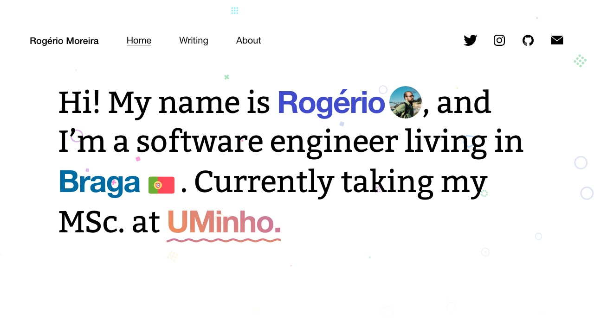

rgllm.com
=============================

## System Preparation

## Local Installation

1. Clone this repo, or download it into a directory of your choice.
2. Inside the directory, run `npm install`.
3. Run `npm start`.

## Build to prod

1. Run `npm run build --prod`